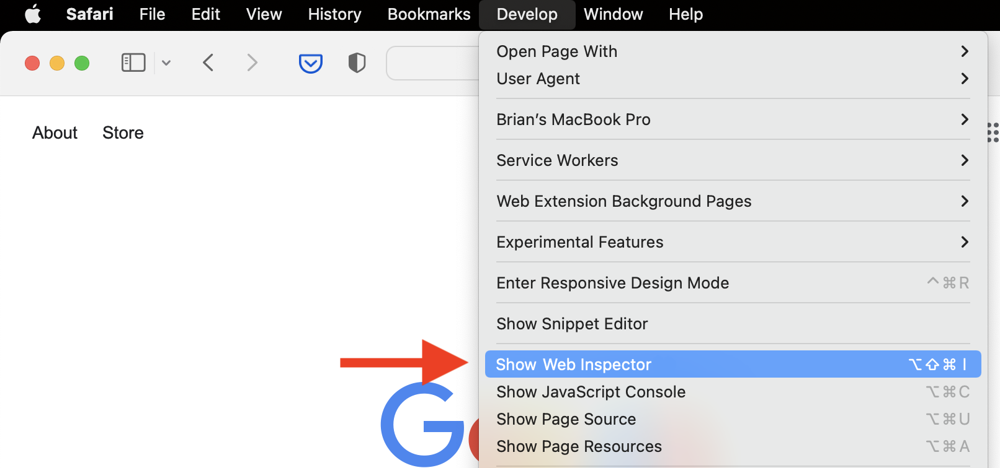
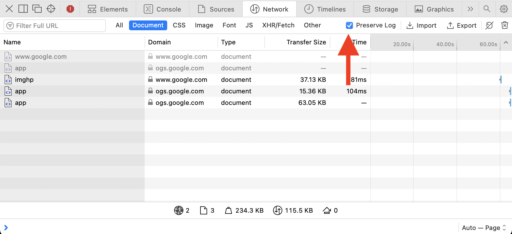
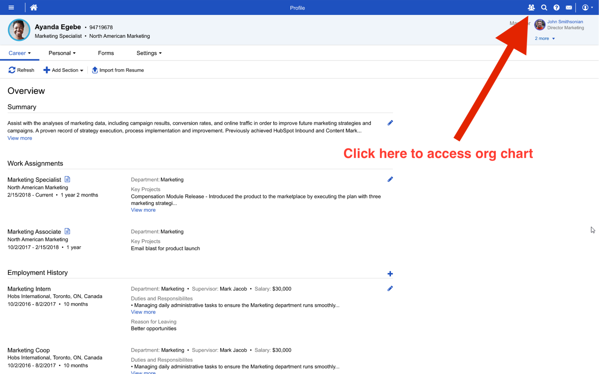
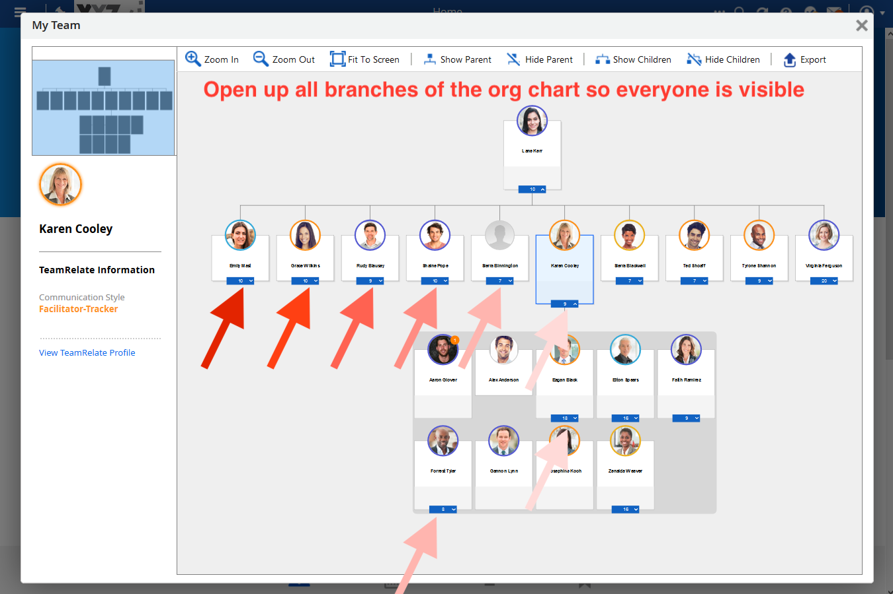
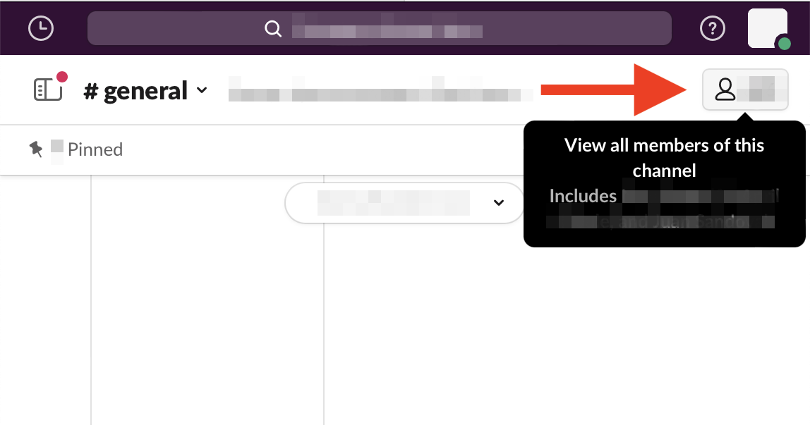
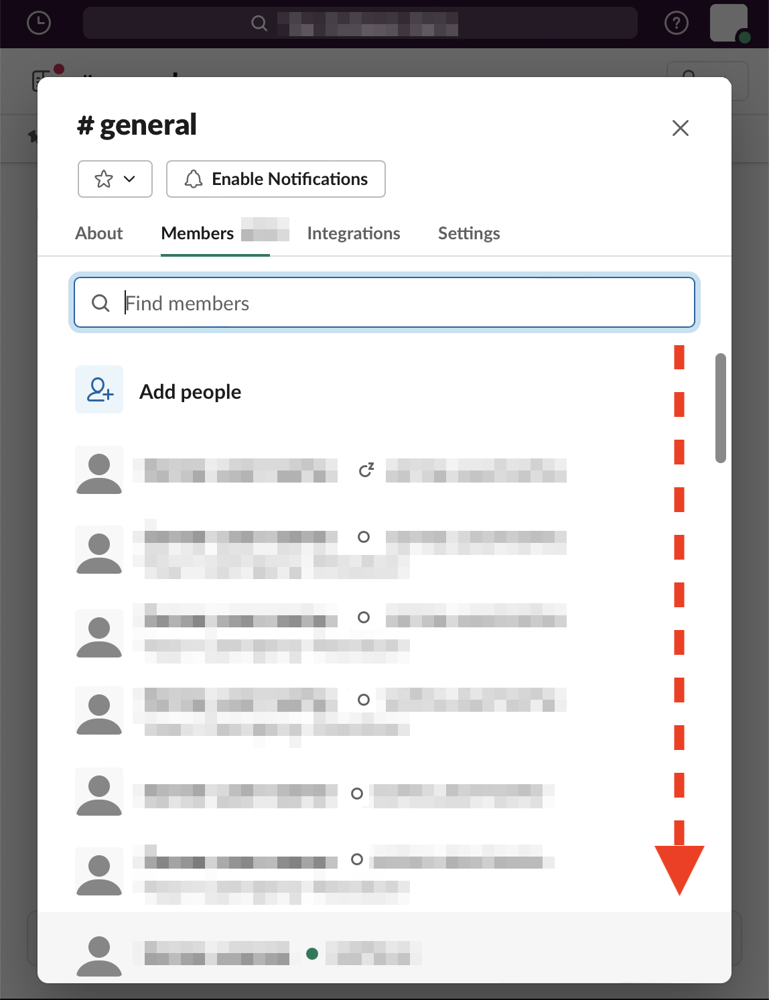
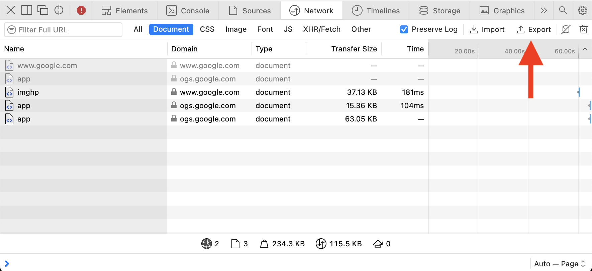

# data-steward

## What is Data Steward?
Data Steward is a tool to help union campaigns in large workplaces, 100+ employees, build their member map. If you're
unfamiliar with what a member map is, or the basics of unionizing your workplace, we highly recommend reading 
[Secrets of a Successful Organizer](https://labornotes.org/secrets) and signing up for a training from a union like the
[Communication Workers of America](https://www.code-cwa.org)!

Made with love by game industry worker-organizers ❤️

Want to meet fellow worker-organizers? Check out the orgs below!

* [Game Workers of Southern California](https://twitter.com/GWSoCal)
* [Game Workers Unite Montréal](https://twitter.com/GWU_Montreal)
* [Game Workers Unite Bay Area](https://twitter.com/GWU_BayArea)

## FAQs
###### Who is this tool for?
While I have tried to make this tool as user friendly as possible, it does require a certain level of technical
web development or programming experience. If you don't feel comfortable using it I encourage you to organize a fellow
worker who does!
 
###### How does this tool work?
Data Steward works by processing **.har** files exported from your web browser's developer console while navigating your
company's **Dayforce** and **Slack** – using the web browser version of Slack and *not* the desktop application.
Collection of the .har files does not require any overtly suspicious web activity, and requires you to simply use the
relevant sites very similarly to how a typical user would.

###### My company uses Discord, or some other tool not supported!
Please send an email to unionizedogs@gmail.com for discussing support of other platforms. Please do not use your
company's email account to reach out lol.

###### Is this tool legal to use?
Union organizing is legally protected, and it is illegal for your company to fire you for it, however
that does not stop companies from illegally firing organizers. **Protect yourself by attending trainings like the ones
run by Communication Workers of America.** Depending on how you use and share the data collected from this tool, you may be opening yourself to legal litigation
from your company. **Honestly, the best defense is not to get caught lmao.** Do not download and use this tool on
company provided equipment. Are you looking at this page from your work computer? Stop, clear your history, and open it
up on a personal device. Processing the .har files with this tool on a personal device is the best way to avoid company
spyware from discovering what you're doing. Use at your own risk! 

###### Do I need to use this tool to successfully unionize my workplace?
**No!!!** Unionizing your workplace happens through 1 on 1 conversations with your fellow workers, finding shared issues
that you can organize around, and building collective power! No fancy tool or service will make or break your union
campaign! This tool was just created to assist a larger union campaign create and maintain the member map at their
workplace.

## How to use it

### 1 - Setup browser to capture .har logs
 
#### These steps illustrate the process in Safari, but Chrome and Firefox have similar steps.
##### 1.1 - Navigate and select Develop / Show Web Inspector

##### 1.2 - Enable the "Preserve Logs" option

### 2 - Capture Dayforce .har logs
###### Skip this section if your company does not use Dayforce
##### 2.1 - Log into Dayforce and select the org chart button in the top right

##### 2.2 - Open up all branches of your company's org chart

### 3 - Capture Slack .har logs
###### Skip this section if your company does not use Slack
##### 3.1 - Log into the browser version of Slack and go to a channel with everyone in it, such as General or Random, and select "View all members of this channel"

##### 3.2 - Scroll down the entire list of members for that channel

### 4 - Export the captured .har logs
##### 4.1 - Select "Export" in your browser's web inspector, this may take awhile for very large .har logs

### 5 - Processing the .har logs

##### 5.1 - Pull this project and open it in a Python environment of your choice – such as PyCharm
##### 5.2 - Place all .har logs in the project's "resources" directory
Create this directory if it does not exist.
##### 5.3 - Run "main.py"
##### 5.4 - Check the default output
There will now be a `rules.json` file in your project's `resources` directory, and a `Member Map.csv` file in your
`exports` directory.

Further elaboration of the `rules.json` file is still **TODO**